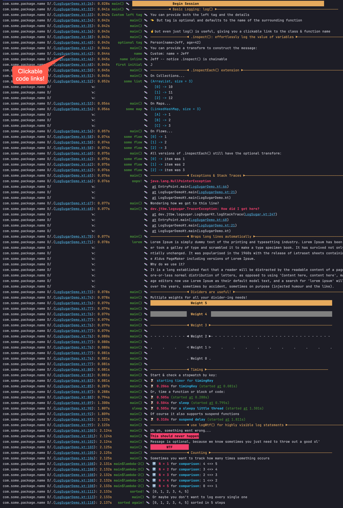

## 🍬 LogSugar: syntax sugar for debug logs 🍬

Debuggers are all well and good, but when you have to break out the debug log statements, they should be powerful!

LogSugar is a small library intended to make debugging via log statements easier.

## Features
1. Click to jump to where you logged from (like you'd see in stack traces)
2. Extension functions for inspecting values
3. Measure elapsed time & count occurrences
4. ...etc

## Basic Usage

build.gradle.kts:
```kotlin
implementation("com.github.JeffWright:logsugar:<VERSION>")
```
Optional: Call this from wherever you want. `configure()` has additional options.
```kotlin
LogSugar.configure { tag, message ->
  // If you're on Android, this looks good with Android Studio's "compact" view.  If you're not, you can use println() or anything else
  Log.d("LogSugar", "$tag: $message")
}
```

Use it:
```kotlin
class LogSugarDemo {
  fun demo() {    
    log("some message")
    someObject.inspect()
  }
}
```
Shows:
```
16:40:55.076  D  .(LogSugarDemo.kt:8): 0.002s      demo() 🍬 some message
16:40:55.077  D  .(LogSugarDemo.kt:9): 0.002s      demo() 🍬 SomeObject(prop1=something, prop2=42)
```

## Full Demo

See [LogSugarDemo.kt](src/main/kotlin/LogSugarDemo.kt)

## Result:
NOTE: Android logcat supports color but Android Studio's logcat view does not. 😢

[View full size](img/result.png)



Author: Jeff Wright
