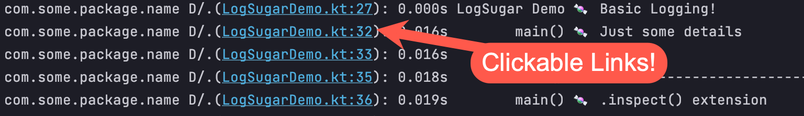

## 🍬 LogSugar: syntax sugar for debug logs 🍬

Debuggers are great, but when you have to break out the debug log statements, they should be powerful!

## Usage:

### Configure
Call this from wherever you want. `configure()` also has more options.
```kotlin
LogSugar.configure { tag, message ->
  println("com.some.package.name D/$tag: $message")
  // Or if you're on Android:
  // Log.d(tag, message)
}
```

## Basic Logging

```kotlin
log(
  tag = "LogSugar Demo",
  details = "Basic Logging!"
)
// tag is optional, defaults to the name of the surrounding function
log("Just some details")
log() // Useful breadcrumb even with no parameters
```

#### Result:
```txt
com.some.package.name D/.(LogSugarDemo.kt:27): 0.000s LogSugar Demo 🍬 Basic Logging!
com.some.package.name D/.(LogSugarDemo.kt:32): 0.014s        main() 🍬 Just some details
com.some.package.name D/.(LogSugarDemo.kt:33): 0.014s        main() 🍬 
```

#### Plus... (at least in IntelliJ/Android Studio)


## .inspect()
```kotlin
logDivider()
log(".inspect() extension")
// .inspect() extension for logging values:
val obj = "string"
obj.inspect(tag = "obj")
// Tag is still optional
obj.inspect()
// You can provide a transform to construct the message
Person("Jeff", 42)
  .inspect("name") { it.name }
// .inspect() returns this, so you can chain it
val initial = Person("Jeff", 42)
  .name
  .inspect("name inline")
  .first()
```

#### Result:
```txt
com.some.package.name D/.(LogSugarDemo.kt:35): 0.016s        main() 🍬 ------------------------------------------------
com.some.package.name D/.(LogSugarDemo.kt:36): 0.017s        main() 🍬 .inspect() extension
com.some.package.name D/.(LogSugarDemo.kt:39): 0.017s           obj 🍬 string
com.some.package.name D/.(LogSugarDemo.kt:41): 0.017s        main() 🍬 string
com.some.package.name D/.(LogSugarDemo.kt:44): 0.017s          name 🍬 Jeff
com.some.package.name D/.(LogSugarDemo.kt:48): 0.017s   name inline 🍬 Jeff
```

## .inspectEach() for Collections/Maps/Flows
```kotlin
logDivider()
log(".inspectEach() extension")
// .inspectEach for logging Collections...
listOf(10, 11, 12)
  .inspectEach("some list")
listOf(listOf(1, 2), listOf(3, 4), listOf(5, 6))
  .inspectEach("another list") { it.first() }

// ... and Maps
mapOf("A" to 1, "B" to 2, "C" to 3)
  .inspectEach("some map")

// ... and Flows
runBlocking {
  flowOf(1, 2, 3)
    .inspectEach("some flow") { "item from flow: $it" }
    .launchIn(this)
}
```

#### Result:
```txt
com.some.package.name D/.(LogSugarDemo.kt:51): 0.017s        main() 🍬 ------------------------------------------------
com.some.package.name D/.(LogSugarDemo.kt:52): 0.017s        main() 🍬 .inspectEach() extension
com.some.package.name D/.(LogSugarDemo.kt:55): 0.024s     some list 🍬 (ArrayList, size=3)
com.some.package.name D/                    ↘:                      🍬   [0] -> 10
com.some.package.name D/                    ↘:                      🍬   [1] -> 11
com.some.package.name D/                    ↘:                      🍬   [2] -> 12
com.some.package.name D/.(LogSugarDemo.kt:57): 0.027s  another list 🍬 (ArrayList, size=3)
com.some.package.name D/                    ↘:                      🍬   [0] -> 1
com.some.package.name D/                    ↘:                      🍬   [1] -> 3
com.some.package.name D/                    ↘:                      🍬   [2] -> 5
com.some.package.name D/.(LogSugarDemo.kt:60): 0.027s      some map 🍬 (LinkedHashMap, size=3)
com.some.package.name D/                    ↘:                      🍬   [A] -> 1
com.some.package.name D/                    ↘:                      🍬   [B] -> 2
com.some.package.name D/                    ↘:                      🍬   [C] -> 3
com.some.package.name D/.(LogSugarDemo.kt:65): 0.044s     some flow 🍬 [0] -> item from flow: 1
com.some.package.name D/.(LogSugarDemo.kt:65): 0.044s     some flow 🍬 [1] -> item from flow: 2
com.some.package.name D/.(LogSugarDemo.kt:65): 0.044s     some flow 🍬 [2] -> item from flow: 3
```

## etc...
```kotlin
logDivider()
// Wondering how we got to this line?
logStackTrace("How did I get here?")

logDivider()
// Wraps lines if the message length exceeds max:
log("lorem", loremIpsum)
```

#### Result:
```txt
com.some.package.name D/.(LogSugarDemo.kt:69): 0.046s        main() 🍬 ------------------------------------------------
com.some.package.name D/.(LogSugarDemo.kt:71): 0.046s        main() 🍬 dev.jtbw.log.TracerException: How did I get here?
com.some.package.name D/                    ↘:                      🍬 	at dev.jtbw.log.LogSugarKt.logStackTrace(LogSugar.kt:253)
com.some.package.name D/                    ↘:                      🍬 	at EntryPoint.main(LogSugarDemo.kt:71)
com.some.package.name D/                    ↘:                      🍬 	at LogSugarDemoKt.main(LogSugarDemo.kt:12)
com.some.package.name D/                    ↘:                      🍬 	at LogSugarDemoKt.main(LogSugarDemo.kt)
com.some.package.name D/.(LogSugarDemo.kt:73): 0.046s        main() 🍬 ------------------------------------------------
com.some.package.name D/.(LogSugarDemo.kt:75): 0.047s         lorem 🍬 Lorem Ipsum is simply dummy text of the printing and typesetting industry. Lorem Ipsum has been the industry's standard dummy text ever since the 1500s, when an unknown printer took a galley of type and scrambled it to make a type specimen book. It has survived not only five 
com.some.package.name D/                    ↘:                      🍬 centuries, but also the leap into electronic typesetting, remaining essentially unchanged. It was popularised in the 1960s with the release of Letraset sheets containing Lorem Ipsum passages, and more recently with desktop publishing software like Aldus PageMaker including ve
com.some.package.name D/                    ↘:                      🍬 rsions of Lorem Ipsum.
com.some.package.name D/                    ↘:                      🍬 Why do we use it?
com.some.package.name D/                    ↘:                      🍬 It is a long established fact that a reader will be distracted by the readable content of a page when looking at its layout. The point of using Lorem Ipsum is that it has a more-or-less normal distribution of letters, as opposed to using 'Content here, content here', making i
com.some.package.name D/                    ↘:                      🍬 t look like readable English. Many desktop publishing packages and web page editors now use Lorem Ipsum as their default model text, and a search for 'lorem ipsum' will uncover many web sites still in their infancy. Various versions have evolved over the years, sometimes by a
com.some.package.name D/                    ↘:                      🍬 ccident, sometimes on purpose (injected humour and the like).
```

Author: Jeff Wright
